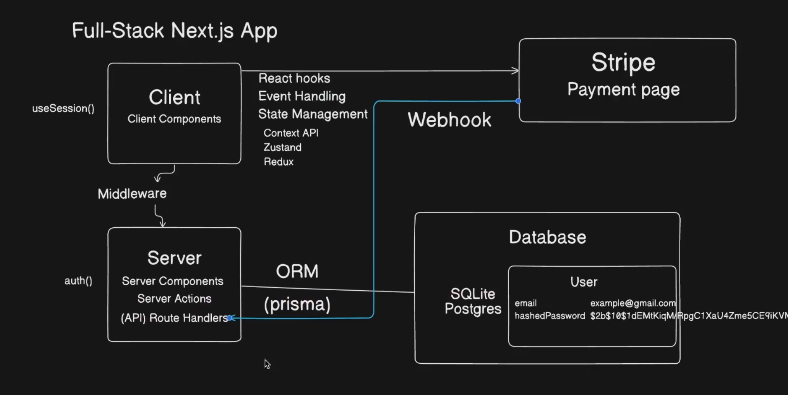
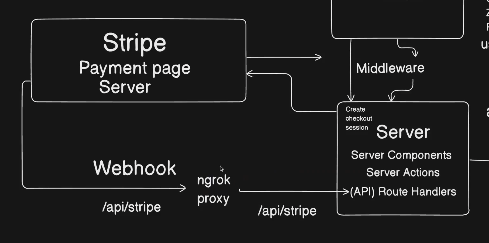

## Payment Integration

To help you visualize the payment process, here are two images illustrating the flow:





## Stripe

Our application uses [Stripe](https://stripe.com/) to securely process payments. Full access to the application is granted only to users who have purchased a valid plan.

### Testing Payments with Ngrok

To test Stripe payments during development, we use [Ngrok](https://dashboard.ngrok.com/) to tunnel localhost to a temporary URL. This setup allows you to simulate production-like payment processing with Stripe while developing locally.

#### Setting Up Ngrok

1. Install Ngrok and set it up according to your operating system instructions. For example, on macOS, you can follow the setup guide [here](https://dashboard.ngrok.com/get-started/setup/macos).

2. Once Ngrok is installed, use the following command to tunnel your local server (assuming it runs on port 3000):

```sh
ngrok http 3000
```

Ngrok will provide you with a temporary URL that you can use to test Stripe purchases and ensure that your payment flow works as expected in a development environment.
